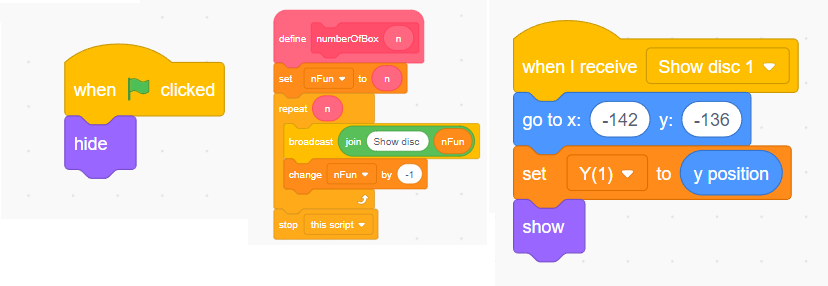

# Tower Of Hanoi

* This is a classic recursion problem and can easily be realized in any programming language.
* The Time Complexity is O(2^n), where n is the number of disks.

<details>

<summary>Problem Explanation </summary>

* There are 3 rods (A, B and C).
* We start with at least 3 disks (the largest disk placed on the bottom and the smallest on the top) placed on the first rod (Rod A).
* The goal is to get all the disks to the last Rod (Rod C) but with a few constraints applied.
  * At a time we can only move one disk.
  * We can only move the top most disk.
  * We cannot place a larger disk on a smaller disk.

</details>

### Coding in Java


```java
public class Tower{
    public static void main(String[] args) {
        towerOfHanoi(3, 'A', 'C', 'B');
    }
    static void towerOfHanoi(int n, char from_rod, char to_rod, char aux_rod) {
        if (n == 0) {
            return;
        }
            
        towerOfHanoi(n - 1, from_rod, aux_rod, to_rod);
        System.out.println("Move disk " + n + " from rod " + from_rod + " to rod " + to_rod);
        towerOfHanoi(n - 1, aux_rod, to_rod, from_rod);
    }
}
```


### Coding in Scratch


We will be placing a constraint for easy implementation, to only allow up to 6 disks.


* First we need to make the required sprites for animation.
* So 3 rods, a base rod and 6 blocks of increasing size are made.
  * The height of the blocks are kept the same as it will help later.
* As the number of disks are variable, we need to create a function which will allow us to only show the disks required, and in the correct place.

#### Function to show only required blocks

* We will hide all the blocks once the Green flag is pressed and using "broadcast message" we will show the required blocks.

<figure><figcaption><p>Flow to show only the required blocks</p></figcaption></figure>

* Now we need to interpret the Java code to Scratch logic.
* It's fairly easy to implement recursion in Scratch

#### Interpreting the Java code to Scratch

* We simply need a function which will accept 'n' (number of disk), 'From rod', 'To rod', and 'Aux Rod'.
  * Then have it inside a 'forever' loop with an if condition to run only if the condition is met.
* We can use 'My Blocks' to create the function.

<figure><figcaption><p>The Function</p></figcaption></figure>


Here speedV is a variable that is assigned the value of (1/speed).

* Speed variable will be connected to a slider, through which the user can control the speed of animation.
* At speed = 1, every animation will take 1 second to complete.


* The block sprites are given command to move to rods using the broadcast and wait block.
* Finally, 'stop this script' is used to halt the program.

#### Animation of block sprites

* Now we have the logic to command the movement of sprites.
* We can connect it to the sprites.
* As seen in the previous picture, we are broadcasting the commands, we have to receive it and let the sprites perform the command.

<details>

<summary>The logic</summary>

* Taking one command to consideration "Move disk 1 from Rod A to Rod B", we can break this down.
* The sprite should first receive the command, then
  * It should move from it's current Y position upwards till the height of the Rod + some amount. (X position is same as Rod A)
  * Then it should move to the X position of Rod B.
  * Then it should come down.

</details>

<figure><figcaption><p>For Rod 1</p></figcaption></figure>

#### What if there are more than 1 block in the same rod?

* If we use this logic as is, the blocks will always go to the bottom, regardless whether there is a disk already there.
* We can fix this by checking if there's another disk in the same Rod.
* We can create a function for this.

<figure><figcaption><p>Function to check if there are blocks already in a rod.</p></figcaption></figure>

* Now that we have the logics available we can run this program.
* Before that, we need to map the disks properly as the logic that we used considers the smallest block to be the first block.
  * But in the current logic, it is the opposite. Here is the largest one is first block.
  * We can use a list to map Sprites.
    * 1 will be mapped to 'n' (where n is the number of blocks).
    * 2 for n-1 and so on.
* Now we can run the program and see it work.


Example Video



Scratch File

